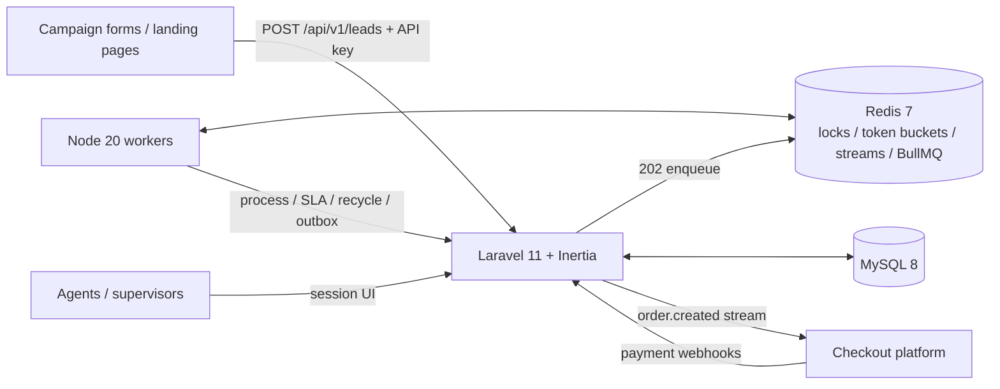

# CRM Flow

Lead-to-order CRM workspace: intake, agent queues, notes, and order handoff. CRM Flow owns leads, agent workflows, and the handoff. It does **not** charge cards — payment execution lives in a separate checkout platform; this service consumes those events idempotently.

## Architecture



Intake path:

1. `POST /api/v1/leads` validates, rate-limits (atomic Redis Lua token bucket per source and API key), enqueues, returns **202**.
2. Workers process enrichment and duplicate scoring. Suspected duplicates are flagged, never silently overwritten.
3. Lead state machine: `new → queued → claimed → working → qualified | disqualified | lost`, plus `lost → queued` recycle.
4. Claim uses `SET lock:lead:{id} NX PX` plus a conditional SQL update (`WHERE state = queued`). Lock expiry returns the lead to the queue.
5. Qualifying a lead writes the **order row and outbox event in the same MySQL transaction**. A Node relay publishes `order.created` to Redis Streams.

## Layout

This repo has its **own** Compose project (`crmflow`), volumes, and host ports so it can run next to other stacks.

| Path | Role |
|---|---|
| `api/` | Laravel 11 (PHP 8.3) API + Inertia/Vue workspace |
| `worker/` | Node.js 20 BullMQ consumers |
| `docker-compose.yml` | `app`, `worker`, `vite`, `mysql`, `redis` |

Host ports (do not share CheckoutHub's 8000/3306/6379):

| Service | Host |
|---|---|
| App | http://localhost:8010 |
| Vite | http://localhost:5174 |
| MySQL | 3310 |
| Redis | 6381 |

## Setup

```bash
cd crm-flow
docker compose up --build
```

Composer install, migrate, and seed run inside the `app` container on boot.

Demo login:

| User | Password |
|---|---|
| `agent@crmflow.test` | `password` |
| `agent2@crmflow.test` | `password` |
| `supervisor@crmflow.test` | `password` |

Intake API key:

```
cf_live_demo_a1b2c3d4e5f6
```

```bash
KEY=cf_live_demo_a1b2c3d4e5f6

curl -s -H "X-Api-Key: $KEY" -H "Content-Type: application/json" \
  -d '{"name":"Jamie Lead","email":"jamie@example.com","phone":"555-0100"}' \
  http://localhost:8010/api/v1/leads
```

## Tests

Run Pest **inside this project's Compose stack** (Redis is required):

```bash
docker compose up -d redis
docker compose run --rm -e REDIS_HOST=redis -e REDIS_PORT=6379 app php vendor/bin/pest
```

Coverage: duplicate payment webhook replay, concurrent claim (one winner), SLA escalation, 5,000-request burst intake, outbox handoff, assignment strategies, lead state machine.

## Demo script

```bash
chmod +x scripts/demo.sh
./scripts/demo.sh
```

Shows:

1. 5,000-request campaign burst and intake latency percentiles
2. Two agents racing a single claim
3. Duplicate payment webhook replay (`status: duplicate`)
4. Deleted Redis claim lock → lead returns to the queue

## Redis keys

| Key | Purpose |
|---|---|
| `tb:{bucket}` | token bucket hash |
| `lock:lead:{id}` | claim mutex (`SET NX PX`) |
| `rr:queue:{id}` | round-robin cursor |
| `crmflow:jobs:leads.intake` | Laravel → worker intake list |
| `crmflow:stream:order.created` | outbox Redis Stream |
| `crmflow:jobs:dead` | dead-letter list |

## API

| Method | Path | Auth |
|---|---|---|
| `GET` | `/api/v1/health` | public |
| `POST` | `/api/v1/leads` | `X-Api-Key` — 202 intake |
| `GET` | `/api/v1/leads` | filters + full-text `q` |
| `POST` | `/api/v1/leads/{id}/claim` | agent session or `agent_id` |
| `POST` | `/api/v1/leads/{id}/convert` | qualify → order + outbox |
| `POST` | `/api/v1/webhooks/payments` | `X-Webhook-Secret` |
| `POST` | `/api/v1/internal/*` | worker bearer token |

Artisan:

```bash
docker compose exec app php artisan crmflow:dead-letter list
docker compose exec app php artisan crmflow:dead-letter retry --event=...
docker compose exec app php artisan crmflow:outbox-replay --from=1 --to=99
docker compose exec app php artisan crmflow:release-expired
```
